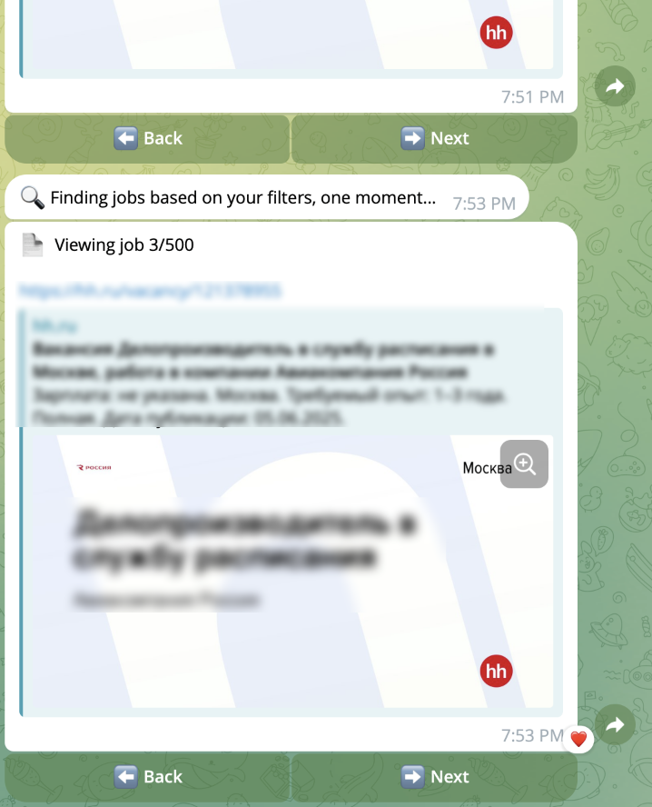

# 📄 VacancyBot  
AI-powered chatbot that finds your ideal job.

VacancyBot is a Telegram-based assistant that helps users search for jobs on hh.ru.  
Users upload a simple text form with their job preferences, and the bot finds relevant offers using the HeadHunter API.

---

# Bot Interface

## **run_bot.py**  

This file is a basic example of how to launch the bot.

To use it, you need to create your own Telegram bot and get a Bot Token. Creating a bot is free and easy.

---

## Module: `telegram_interface.telegram_bot`

**Purpose:**  
This module implements the Telegram bot interface.  
It lets users talk to the bot, fill out a form with their job preferences, and get job offers from the [hh.ru](https://hh.ru) website.

---

### 📁 Directories

- `data/bot_user_data/candidate_form/`  
  Stores uploaded raw `.txt` job preference forms from users.

- `data/bot_user_data/parsed_user_data/`  
  Stores parsed JSON files containing user preferences (used for API queries).

- `telegram_interface/job_form_template/job_form_template.txt`  
  The form template file users receive when they use the `/fill_form` command.

---

<h3>💬 Supported Bot Commands</h3>

<ul>
  <li><code>/start</code> — Welcomes the user and introduces the bot.</li>
  <li><code>/help</code> — Displays help message with available commands.</li>
  <li><code>/fill_form</code> — Sends the user a form template to define job search preferences.</li>
  <li><code>/view_form</code> — Returns the latest uploaded form back to the user.</li>
  <li><code>/search</code> — Initiates job search using submitted form data.</li>
</ul>

Here is an example of how job links will appear in the chat:

  

## 🔍 Module: search_handler/searcher.py

This module lets the Telegram bot search for jobs on HeadHunter (hh.ru) using the user's job preferences. It returns a list of relevant job vacancies.

###  Usage

- The function `search_vacancies_by_params_hh(hh_api_client, user_vacancy_hh_filters, client_id)` performs a paginated search.
- The argument `user_vacancy_hh_filters` must be a **dictionary formatted exactly as expected by the HH API** (matching the parameter names and formats specified in the official [API docs](https://github.com/hhru/api)).

###  Uses: **`vacancy_site_apis.hh_api`**

This module uses the `HHClient` class from **`vacancy_site_apis.hh_api`** to send search requests to HeadHunter.

- `HHClient.search_simple(**kwargs)` makes a request to `https://api.hh.ru/vacancies` using the given keyword arguments.
- All filters passed to `search_vacancies_by_params_hh` are forwarded directly to the API through `HHClient`, so they must be valid API parameters.